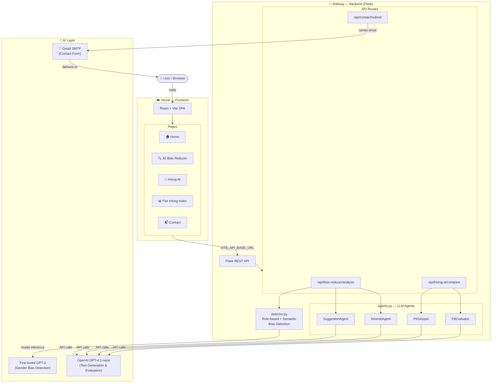

# BIOS Check — High-Level Architecture Diagram

Paste the Mermaid code below into https://mermaid.live to generate the diagram image.

---

## Plain-English Summary (for slides)

| Layer | Technology | Hosted On |
|-------|-----------|-----------|
| Frontend | React + Vite (SPA) | Vercel |
| Backend API | Python / Flask | Railway |
| Bias Detection | Rule-based detector + Fine-tuned GPT-2 | Railway |
| AI Agents | OpenAI GPT-4.1-nano | OpenAI API |
| Contact | Gmail SMTP | — |

**Data flow:**
1. User pastes a job description in the browser
2. Frontend sends it to the Flask API on Railway
3. `detector.py` scores it using rules + fine-tuned model
4. LLM agents generate suggestions and an inclusive rewrite
5. Results stream back to the browser
